# Olympic weightlifting technique recognition #
## Motivation ##
Among all the strength feats of human beings, Olympic weightlifting is one of the most popular and surprisingly difficult. It does not only require a good amount of strength to perform the lifts and also excellence in lifting technique to achieve a reasonable practice of the sport.

It is obnoxiously hard to develop proper technique if you do not have a trainer beside you who has an eye on you to correct the mistakes you make in your lifts. Long term, you might give up the practice of the sport, or worse, get injured because of a terrible technique.

There are a few elite athletes who upload every-day their lifts to social media, there are also already developed some human pose recognition algorithms(AI) developed that offer a real-time analysis of yoga technique. 

By combining those two sources, I believe there is a reasonable chance of learning how to lift appropriately. The path is chock-full of hurdles, because most videos have partial joint occlusion during the lift, also in part due to the speed of the videos, and the list could continue.

## Snatch ##
Starting from this lift I analyzed several athletes lifts and obtained the angle of each of their joints over time during the lift, trying to find a pattern that could be learned.

The 3 first images of each joint correspond to different elite athletes performing a snatch. The last one correspond to one of my attempts of making a snatch, but with terrible technique.
### Ankle ###

  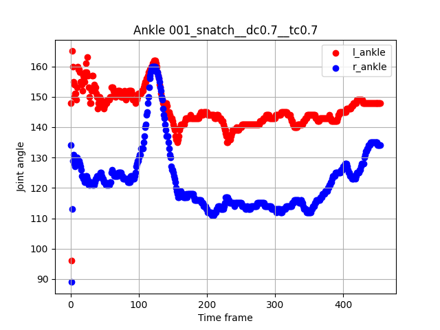
  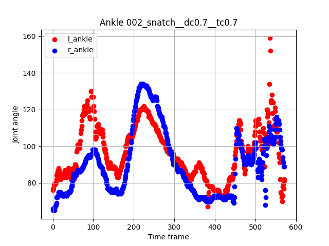
  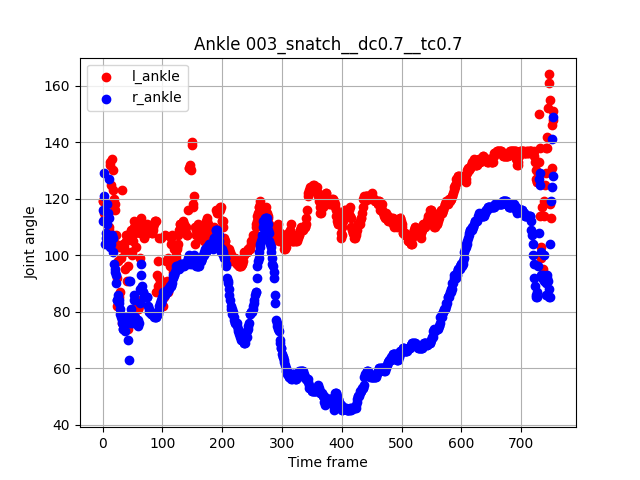
  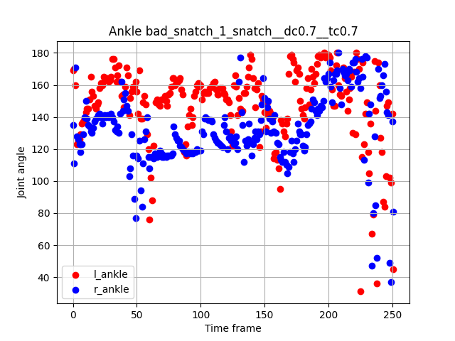

### Knee ###

  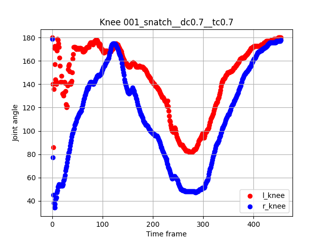
  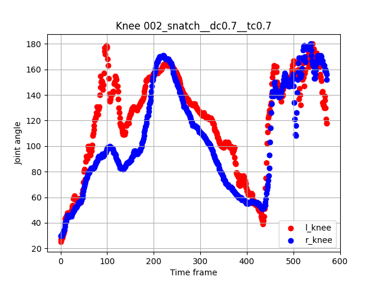
  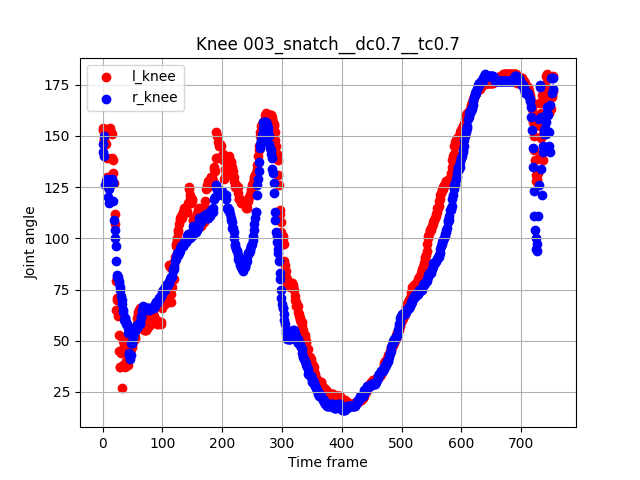
  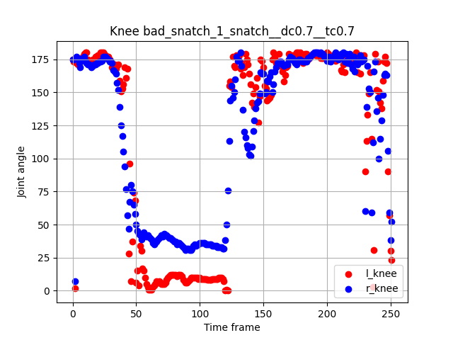

### Hip ###

  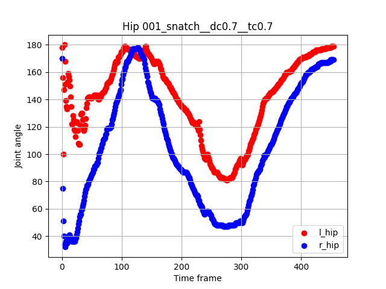
  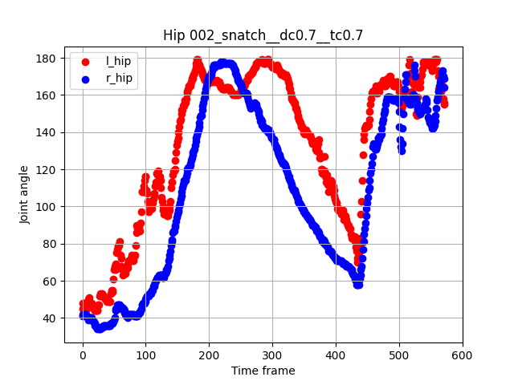
  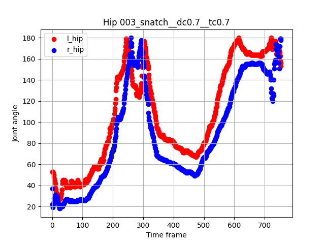
  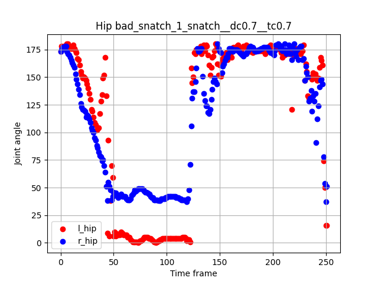

### Shoulder ###

  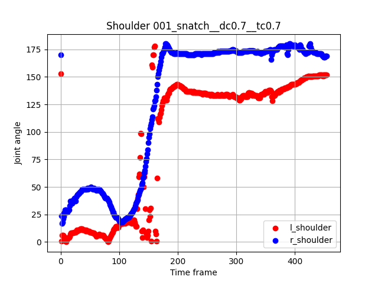
  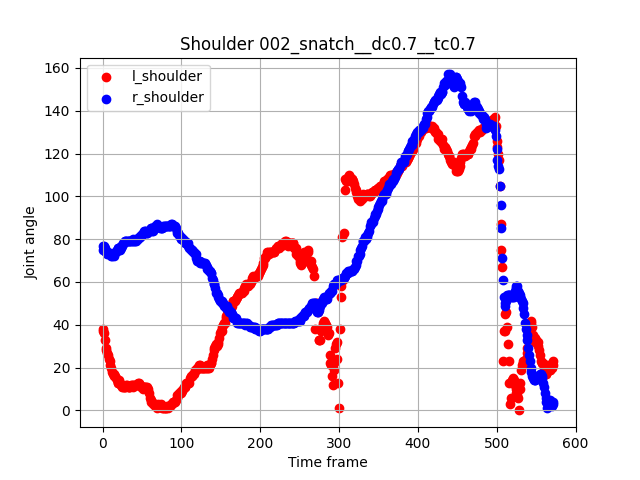
  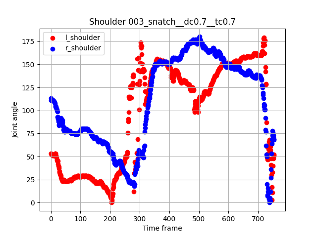
  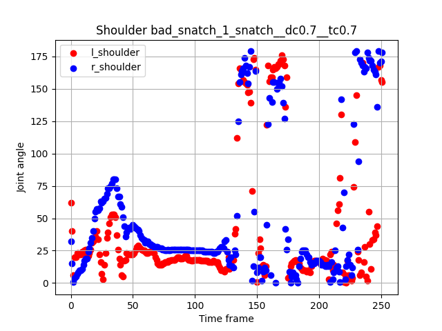

### Elbow ###

  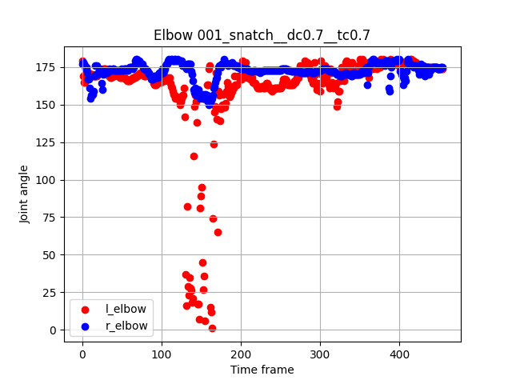
  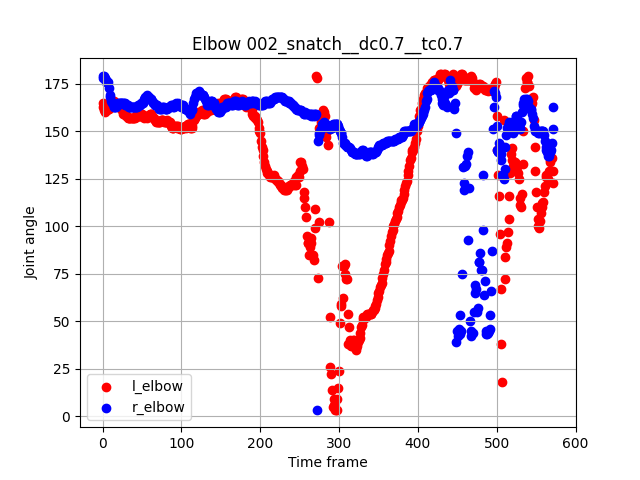
  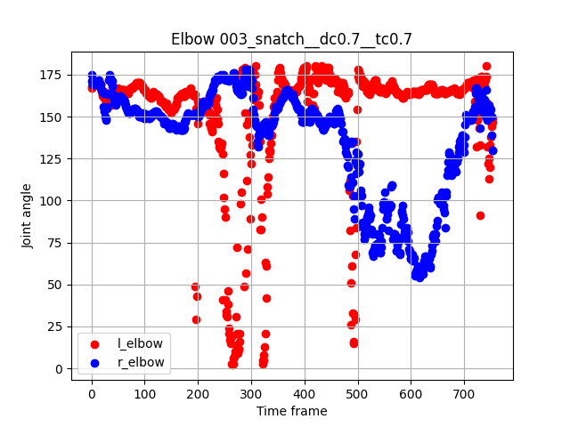
  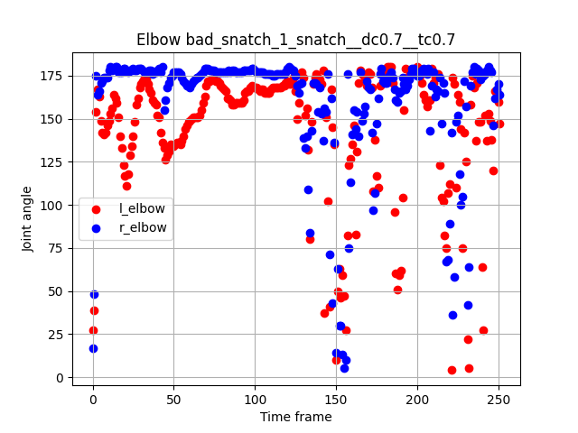

